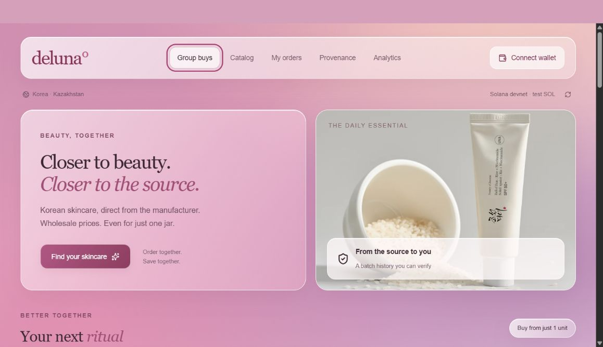
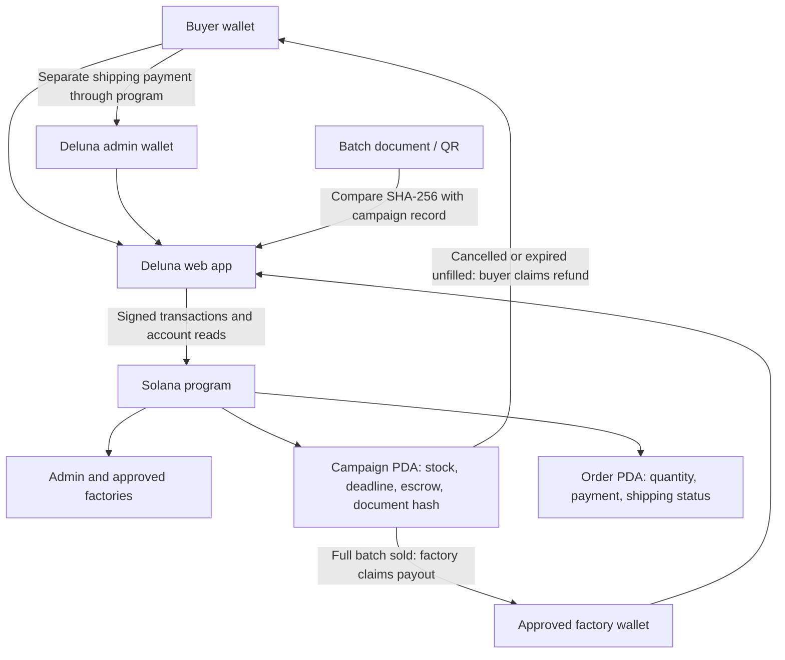

# Deluna — Wholesale Beauty, One Item at a Time

> Group buying for Korean skincare on Solana: buyers fill a manufacturer's batch together, purchase from just one unit at a fixed wholesale price, and pay through an on-chain escrow contract.

[Live Demo](https://deluna-app.vercel.app) · [Docs](docs/development.md) · [Solana Program](https://explorer.solana.com/address/27yt3x7MiqctpH7y6DPybenLvruJkGmSrZxxkZitQu7V?cluster=devnet)



---

## Submission to Solana Create / Colosseum

Built as a working devnet MVP for the Solana Create workshop, with an initial focus on Almaty, Astana, and Shymkent, Kazakhstan.

| Name | Role | Contact |
| --- | --- | --- |
| daspberry3879 | Project maintainer | [GitHub](https://github.com/daspberry3879) |

**Status:** Live demo deployed on Vercel; custom program deployed on Solana devnet. The walkthrough video, presentation, and submission URL have not yet been published.

---

## Problem and Solution

### 1. Wholesale Access Requires Large Orders

- **Problem:** Individual shoppers and small stores may not be able to meet a manufacturer's batch size alone.
- **Deluna:** Buyers combine their demand into one batch. Each participant can buy from one unit up to the remaining stock, at the same fixed unit price.

### 2. Group Purchases Depend on Manual Payment Coordination

- **Problem:** Participants need to know where their money is held and what happens if a group order does not fill.
- **Deluna:** The Solana program holds product payments, enables the factory payout only when the full batch sells out, and allows individual refunds after cancellation or an unfilled deadline. Refunds after a factory payout are not guaranteed by the contract.

### 3. Product Origin Is Difficult to Check

- **Problem:** A product listing alone does not establish who issued its batch documentation or whether that document has changed.
- **Deluna:** Approved manufacturer wallets register batch document hashes on-chain. Buyers can verify the issuer and compare documents using a batch code or QR. This verifies the record, not the physical authenticity of a product.

### 4. Final Shipping Costs Are Known Later

- **Problem:** Cargo shipping costs depend on the weight measured when goods leave the factory.
- **Deluna:** Product payment and shipping payment are separate. Deluna issues a weight-based invoice after the batch is paid out; the buyer pays it through Solana before collection.

---

## Why Solana

- **Shared payment state:** Buyers, manufacturers, and Deluna read the same campaign and order accounts rather than relying on manually updated payment records.
- **Program-enforced rules:** A custom Rust program checks stock limits, payout eligibility, refund eligibility, and administrator permissions.
- **Atomic updates:** A purchase transfers SOL and updates the order together. A shipping payment transfers funds and marks its invoice paid in the same transaction.
- **Wallet-based participation:** Phantom and Solflare provide transaction signing. Public account records make the demo's payment activity independently inspectable.

Solana is the payment and campaign-state core of the MVP. The current deployment uses **devnet test SOL only**.

---

## Summary of Features

- Nine Korean skincare products with KZT-first illustrative pricing.
- Nine seeded open campaigns, initially with three test buyers each, plus three completed demo campaigns.
- Purchases from one unit, with immediate on-chain payment into campaign escrow.
- Factory payout after the full batch sells out.
- Individual refunds for cancelled or expired, unfilled campaigns.
- Separate shipping invoices and payments based on actual weight.
- Batch document verification through an approved issuer and SHA-256 hash.
- Buyer orders, manufacturer tools, and a Deluna administrator dashboard.
- Analytics based on on-chain units purchased, unique wallets, and payments.
- Responsive English interface with pink glass styling.

---

## Tech Stack

| Layer | Technology |
| --- | --- |
| On-chain program | Rust · native `solana-program` |
| Client / Wallets | TypeScript · `@solana/web3.js` · Phantom · Solflare |
| Frontend | React · Next.js · Tailwind CSS · shadcn components |
| Local / Alternate build | Vinext · Vite |
| Provenance | SHA-256 document hashing · QR codes |
| Hosting | Vercel |
| Validation | Local Solana validator integration tests · confirmed devnet transactions |

---

## Architecture



The program address is [`27yt3x7MiqctpH7y6DPybenLvruJkGmSrZxxkZitQu7V`](https://explorer.solana.com/address/27yt3x7MiqctpH7y6DPybenLvruJkGmSrZxxkZitQu7V?cluster=devnet).

See the [development guide](docs/development.md#architecture) for source files, deployed addresses, contract checks, and demo seeding instructions.

---

## Quick Start

**Prerequisites:** Node.js 22.13+ and npm. A Phantom or Solflare wallet with devnet SOL is needed to make purchases. No private keys or environment variables are needed to run the frontend.

```sh
# Clone the repository
git clone https://github.com/daspberry3879/deluna.git
cd deluna

# Install dependencies
npm ci

# Start the local frontend
npm run dev

# Build for Vercel
npm run build:vercel
```

To try the hosted version, open the [live demo](https://deluna-app.vercel.app), connect a wallet, select **Catalog → Join group buy**, choose a quantity, accept the terms, and sign the payment. The confirmed purchase appears in **My orders**.

Contract validation requires a local validator and local test keypairs. See [contract build and validation](docs/development.md#contract-build-and-validation) before running the test scripts. Cloning the repository does not provide the signing keys for the deployed demo.

---

## Roadmap

- [x] Deploy the custom payment and campaign program on Solana devnet.
- [x] Implement escrow purchases, factory payouts, and conditional refunds.
- [x] Add separate shipping invoices and on-chain shipping payments.
- [x] Add batch document verification and role-based dashboards.
- [x] Seed completed and open demo campaigns with test buyers.
- [x] Publish the English MVP on Vercel.
- [ ] Validate demand with shoppers, small stores, and group-buy organizers in Kazakhstan.
- [ ] Onboard real manufacturers and establish document and product verification procedures.
- [ ] Pilot cargo logistics and shipment tracking.
- [ ] Record the walkthrough and complete the hackathon submission materials.
- [ ] Complete an independent security review before considering mainnet and real payments.

---

## Resources

- [Live Application](https://deluna-app.vercel.app)
- [Source Code](https://github.com/daspberry3879/deluna)
- [Development Documentation](docs/development.md)
- [Solana Devnet Program](https://explorer.solana.com/address/27yt3x7MiqctpH7y6DPybenLvruJkGmSrZxxkZitQu7V?cluster=devnet)
- [Local Contract Validation Results](contract/test-results.json)
- [Seeded Devnet Campaigns](contract/seed-results.json)
- **Project Presentation / Video Demo / Colosseum Submission:** Not yet published.

**Demo scope:** Test SOL only. Brand partnerships, physical product authenticity, and actual shipments are not verified. KZT prices are illustrative, not an exchange-rate conversion. Read the [demo limitations](docs/development.md#demo-limitations) for the full scope.

---

## License

No project license has been specified yet. A license decision is pending.
